# OpenIPReporter

An open-source alternative to Bitmain's IP Reporter for building
**serial → MAC → position** maps during a rack walk.

The thing it does that the vendor tool does not is record the physical position
with every captured report, serial/MAC correlation being a direct join rather
than an assumption that row N of a CSV is grid position N. One missed machine
no longer silently shifts every pairing after it.


---

## Which file do I download?

Go to the [**Releases**](../../releases/latest) page. There are two programs
there, you almost certainly want the first one.

| Download this | If you want |
|---|---|
| **`OpenIPReporter-windows-x64.zip`**<br>**`OpenIPReporter-macos-arm64.zip`** | **The app.** A window you walk a rack with. This is the one. |
| `capture-tool-windows-x64.exe`<br>`capture-tool-macos-arm64` | A command-line tool for recording raw miner broadcasts. Only needed when a miner type is not recognised yet and its wire format has to be worked out. |

Nothing to install either way. Unzip it and run what is inside.

**The laptop must be plugged into the switch in the can you are walking.**
Reports are layer-2 UDP broadcasts. They will not traverse a router, a VPN, or
a Tailscale subnet route, only hosts on that segment will receive them.

This bites hardest with Whatsminers. Antminer reports may still reach a desk
elsewhere on site depending on your network setup, which makes it look as
though the tool works from anywhere; Whatsminers will simply never arrive. **If
you see one type of miner reporting and the other not, check your patch panel
first.**

### First run on Windows

Two clicks past a warning, and it runs. Nothing to install.

**1. Download `OpenIPReporter-windows-x64.zip`** from the Releases page.

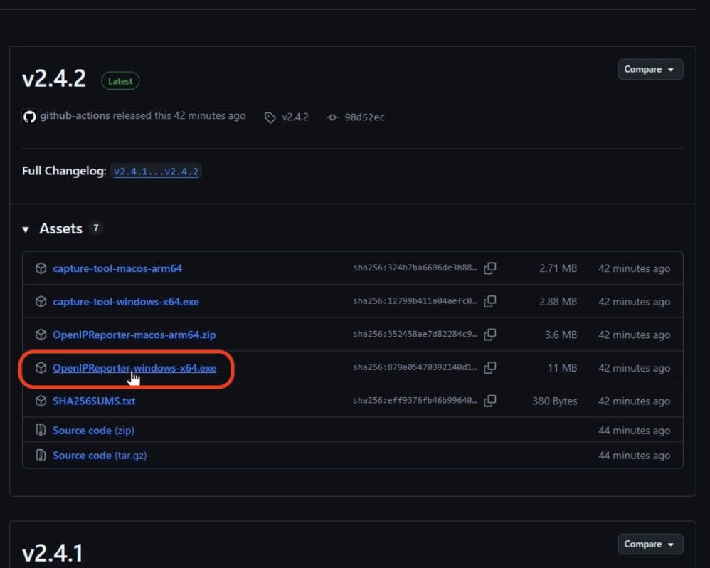

**2. Unzip it** and open the `OpenIPReporter` folder, then run
`OpenIPReporter.exe`.

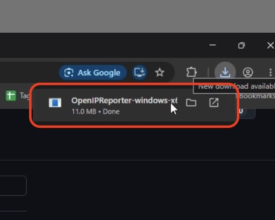

**3. "Windows protected your PC" appears.** Click **More info**.

This is SmartScreen saying the file has no reputation yet, not a virus
detection, see [Why the warning appears](#why-the-warning-appears).

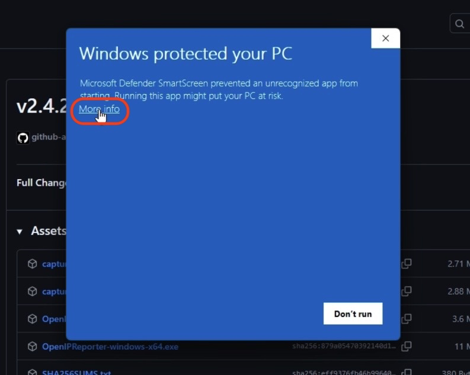

**4. Click Run anyway.**

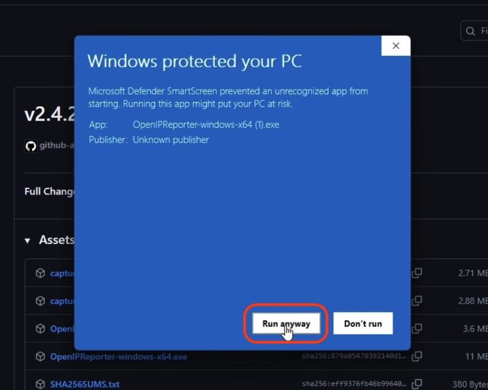

**5. Allow it through the firewall**, making sure **Private networks** is
ticked. Miss this and the app runs but hears nothing at all, which looks
exactly like a broken app. An administrator has to click it.

This prompt only appears the first time, and not at all if a rule for the app
already exists, which is why there is no screenshot of it here.

### Why the warning appears

SmartScreen is not saying the file is malicious. It is saying it has no
reputation, it has not been downloaded enough times for Microsoft to have an
opinion about it. A tool used by one site will never accumulate that.

Two ways to avoid it:

- **Copy it from an internal share or a USB stick** instead of downloading it
  in a browser. The prompt is triggered by the Mark of the Web, a tag browsers
  attach to downloaded files. Files copied from a file share or removable media
  usually do not carry it.
- **Unblock an already-downloaded copy:** right-click → **Properties** → tick
  **Unblock** → **OK**.

Code signing does not remove this. EV certificates used to bypass SmartScreen
on first download, and
[Microsoft removed that behaviour in 2024](https://learn.microsoft.com/en-us/windows/apps/package-and-deploy/code-signing-options).
Signed files now build reputation the same way unsigned ones do.

### First run on macOS

Recent macOS removed the old right-click → **Open** shortcut for unsigned apps,
so the first launch takes a few more steps than it used to. You only do this
once.

**If you are comfortable in Terminal, this replaces every step below:**

```bash
xattr -dr com.apple.quarantine /Applications/OpenIPReporter.app
```

Then open it normally. Otherwise:

**1. Download `OpenIPReporter-macos-arm64.zip`** from the Releases page.

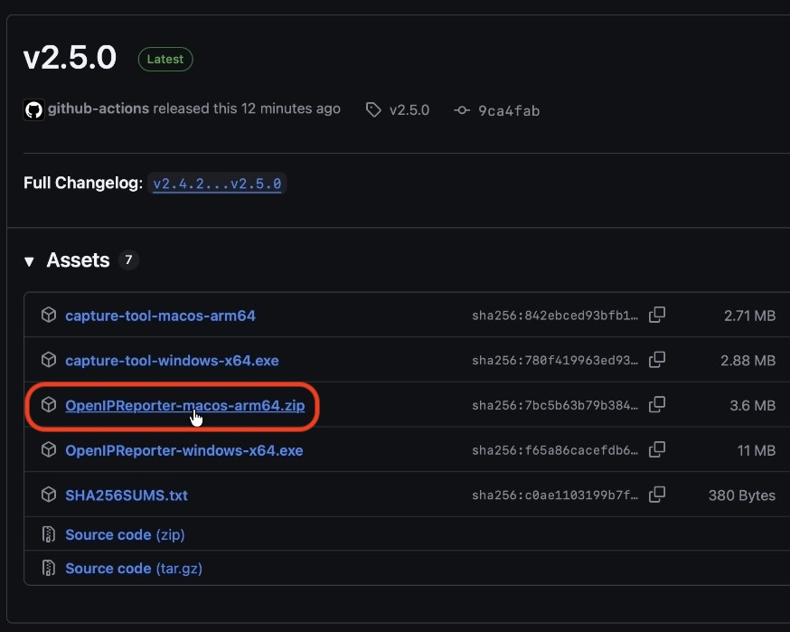

**2. Unzip it and drag `OpenIPReporter.app` into your Applications folder.**

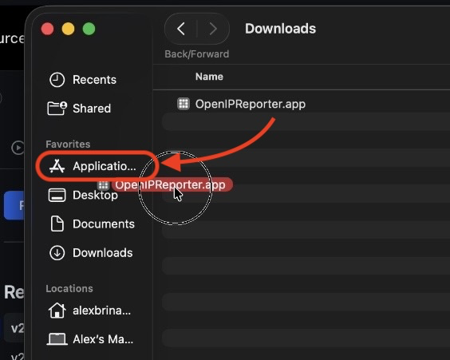

**3. Open the app.**

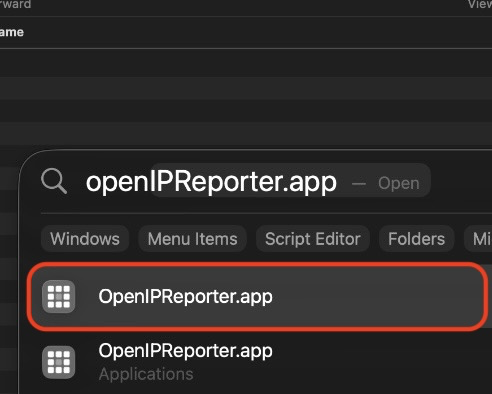

**4. It gets blocked.** Click the **?** at the top right of that box. This opens
Apple's "Apple can't check app for malicious software" page.

Do this *before* dismissing the dialog, clicking Done first takes the **?**
away with it.

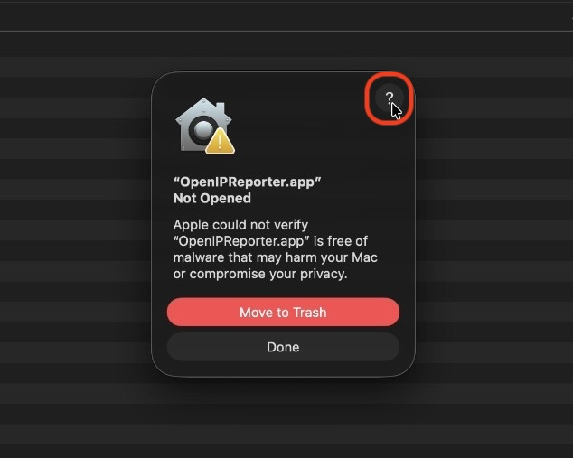

**5. Click Done** on the small window. Not Move to Trash.

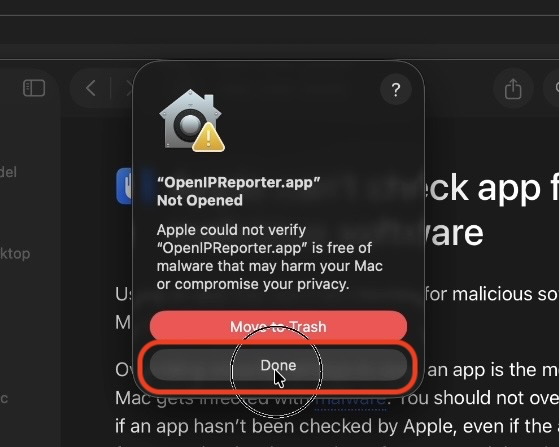

**6. On the help page, click "Open Privacy & Security settings for me"**, which
takes you straight to the right pane.

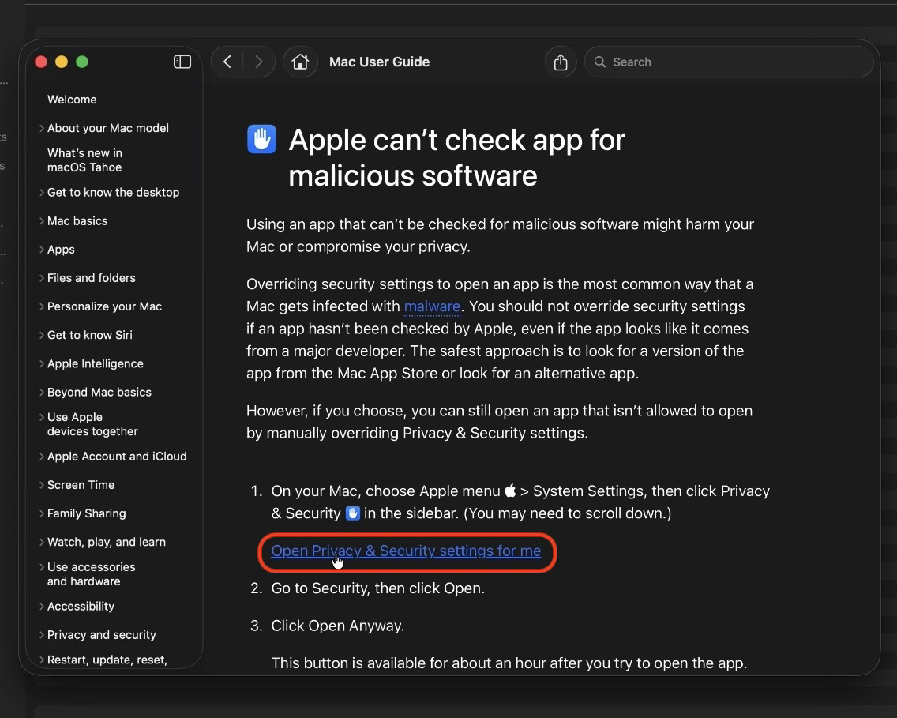

**7. Scroll to the bottom and click Open Anyway**, then click it again on the
prompt that follows.

| In Settings | The confirmation |
|---|---|
| 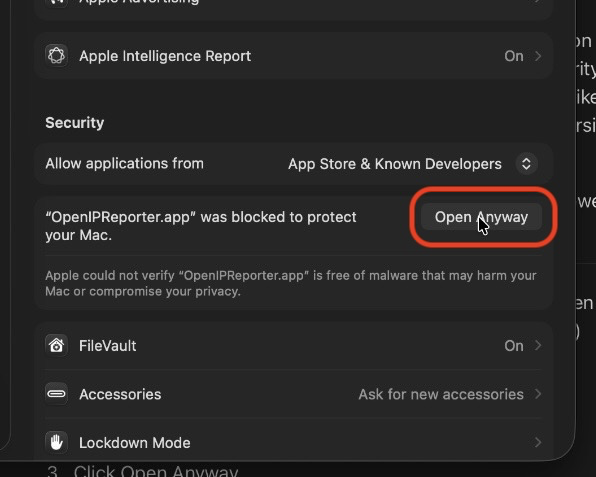 | 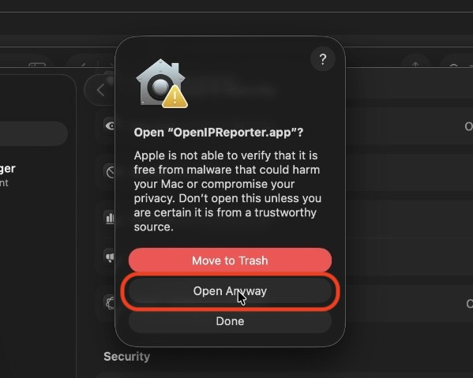 |

**8. Authenticate** with your fingerprint or password.

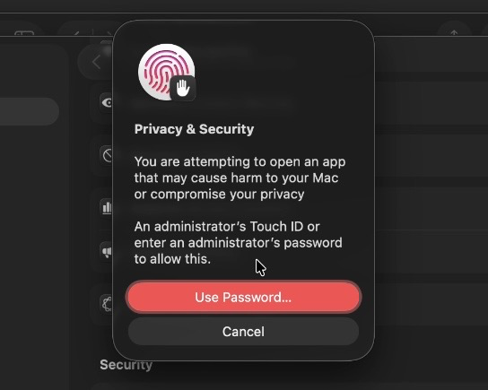

From then on it opens by double-clicking like anything else.

**The command-line tool** is a bare binary rather than an app bundle, so it
needs the executable bit too:

```bash
chmod +x capture-tool-macos-arm64
xattr -d com.apple.quarantine capture-tool-macos-arm64
```

---

## Walking a rack


1. Pick the **Can** and **Rack**, press **Start**.
2. Walk. Press each miner's IP-report button; the row appears on its own. No
   dialog to dismiss.
3. Press **Space** at an empty slot, a switch, or a machine that will not
   report. The position is held open, which is what keeps everything after it
   aligned.
4. Press **Stop** at the end of the rack, then **Export CSV**. Stopping keeps
   the rack on screen, it ends the walk, it does not discard it.

The **Row** and **Column** boxes show where the next machine will land. If you
are off by one, type the right numbers in, the walk moves, nothing already
recorded is touched, and the rest of the rack follows on from there.

### Keys

| Key | Does |
|---|---|
| <kbd>Space</kbd> | Skip a position. The only key you press regularly. |
| <kbd>↑</kbd> <kbd>↓</kbd> | Pick a row |
| <kbd>Enter</kbd> | Edit that row's MAC by hand |
| <kbd>N</kbd> | Edit that row's note |
| <kbd>P</kbd> | Set that row's position |
| <kbd>I</kbd> | Insert a blank above it (everything below shifts down) |
| <kbd>Del</kbd> | Delete it (everything below shifts up) |
| <kbd>Ctrl</kbd>+<kbd>Z</kbd> / <kbd>Ctrl</kbd>+<kbd>Y</kbd> | Undo / redo |
| <kbd>Ctrl</kbd>+<kbd>E</kbd> | Export (once stopped) |

Right-clicking a row does the same things, if your hands are already on the
mouse.

### Duplicates

A MAC already in the rack will not be recorded a second time. You get
`Already recorded at C1/5`, and the position does not advance, the next real
machine takes it.

Antminers send every report twice, one second apart, by design. That pair is
collapsed into one press before any of this applies, so the refusal only ever
fires on a genuine repeat.

### Nothing is lost if the laptop sleeps

The walk is saved after every capture. Starting the same can and rack again
picks up where it left off.

Walks, the can list and preferences are kept together, away from wherever the
program was launched from:

```
Windows   %APPDATA%\OpenIPReporter
macOS     ~/Library/Application Support/OpenIPReporter
```

**Cans… → Show the folder** opens it.

---

## The exported CSV

One file per rack. Row *n* is grid position *n*, and a skipped position is a
blank row, the same shape the existing process already consumes.

```
10.0.0.5,aa:bb:cc:dd:ee:ff
,
10.0.0.7,aa:bb:cc:dd:ee:02
```

If any row in the rack has a **note**, a third column is added to that file:

```
10.0.0.5,aa:bb:cc:dd:ee:ff,
,,wont ip report
10.0.0.7,aa:bb:cc:dd:ee:02,
```

A rack with no notes exports exactly the two-column form, so nothing changes
downstream for a field usually left blank.

A rack walked halfway exports halfway. It is not padded out to a full rack,
because that would make an unfinished walk look finished.


---

## Using it at another site

The can list is not baked into the program. Press **Cans…** next to the can
dropdown to add, edit or remove cans and set the rack shape for each one.


It is saved as `cans.json`, so setting up a second machine is a matter of
copying that one file across. **Show the folder** in that dialog opens the
right place. A fresh install writes the list below as a starting point;
replacing it entirely is the expected thing to do somewhere else.

One thing that does not travel: where a report came from is worked out from
its address, which depends on how the site is numbered. Somewhere addressed
differently that check does not apply, and the app stays quiet rather than
warning about cans that do not exist there.

## Cans and racks

A fresh install has no cans at all. Open **Cans…** and either add them one at a
time, import a `cans.json` from a machine already set up, or start from an
example list and edit it. Nothing about the layout is compiled in.

The rack size sits behind the small button next to each name. It is set once
per can and then never looked at again.

Where a site numbers its cans in the addressing, the app works out which can a
report came from and says so if it does not match the one being walked, rather
than recording it quietly. Somewhere addressed differently that check simply
does not apply and the app stays quiet.

---

## Supported miners

| Type | Port | Payload | Status |
|---|---|---|---|
| **Antminer** | udp/14235 | `10.0.0.5,aa:bb:cc:dd:ee:ff` | Working |
| **Whatsminer** | udp/8888 | `IP:10.0.0.5MAC:aa:bb:cc:dd:ee:ff` | Working |
| Avalon, SealMiner |, |, | Not yet |

> **Whatsminer's button must be held for more than five seconds.** A short
> press does nothing at all, no broadcast is sent. Hold it until the two
> right-hand LEDs flash. This is the single most likely reason a Whatsminer
> appears not to report.

Both vendors are heard by the same listener at the same time, so a mixed can is
one walk rather than two tools.

Adding a vendor is a new file in `internal/parse`, not a change to anything
that already works.

Note that no vendor's report contains a **serial number**, only IP and MAC.
The serial can only come from the sitemap, which is exactly why position has to
be recorded during the walk. It cannot be recovered afterwards.

## The capture tool

Only needed when a miner type is not recognised yet.

```
capture-tool                 record miner broadcasts
capture-tool parse FILE      decode a capture into miner reports
capture-tool ports           list the UDP ports it listens on
capture-tool sniff           how to find a port it cannot see
```

It binds ~77 candidate UDP ports and logs every packet with source, port, hex
and ASCII, to a file that can be sent on for a parser to be written against.
Antminer's port 14235 is known; everything else was found this way.

If a press produces nothing, the miner is using a port not in the list.
`capture-tool sniff` prints the exact `tcpdump` line for your machine, which
sees every port with nothing to install. One run finds it permanently.

### Background noise is normal

Traffic appears the moment it starts, before you touch a miner. The most common
is a 4-byte `01 00 00 00` on **udp/10001** every ~10 seconds from a pile of
`.254` addresses, that is Ubiquiti UniFi device discovery, not miners.

Repeated identical payloads collapse to a count automatically, and
`-mute 10001` silences a port entirely. Neither affects the capture files:
everything received is always written to disk in full.

---

## Not in this tool

- No network scanning. BTC Tools already does that well.
- No config push, firmware, or pool management.
- No guessing where a gap is. If a rack comes up short, it gets reported short.
- No sitemap loading or live position validation. Sitemapping happens in Sheets
  beforehand and that process works; this tool slots into the existing workflow
  without changing anyone else's job.

## Update notice

On startup the app asks GitHub whether a newer release exists. A small notice
appears in the corner while it checks, and the running version sits in the
bottom-right of the status bar with the result next to it:

```
v2.5.0 · up to date        checked and current, click it to read the notes
v2.5.0 · offline           no route to the internet, which is normal in a can
v2.5.0 · v2.6.0 available  click it to see the release notes again
```

If a newer version exists you get its release notes and an **Update now**
button. That downloads the new version, checks it against the SHA-256 published
with the release, replaces this copy and restarts. Nothing downloads unless you
press it.

An update installed this way arrives over HTTP rather than through a browser,
so it carries neither Windows' Mark of the Web nor macOS' quarantine flag, the
new copy starts without the warning the first download had to be clicked past.

If anything fails, the running copy is left untouched and the reason is shown.
**Release page** opens the download in a browser instead.

Turn it off with the checkbox on that notice. Off, the app makes no outbound
network requests at all. It also stays quiet when there is no route to the
internet, which is the usual case standing in a can.

Nothing about your site is sent. The request carries only the program name and
its version. See [CODE_SIGNING_POLICY.md](CODE_SIGNING_POLICY.md#privacy).

## Privacy

Captures and exports contain real MAC addresses, IPs and site layout.
`.gitignore` keeps `captures/`, `exports/`, `sessions/`, sitemaps and any
`*.csv` out of the repo. Only files named `sample-*.csv` are allowed in, and
those must be sanitized.

## Building from source

Requires [Go](https://go.dev/dl/) 1.24+. The app additionally needs
[Wails](https://wails.io/docs/gettingstarted/installation) and a C toolchain,
because it embeds the system webview.

```bash
go build -o capture-tool ./cmd/capture-tool    # the command-line tool
cd gui && wails build                          # the app
```

Releases are built automatically. Tagging is the only step needed to publish:

```bash
git tag v2.6.0 && git push origin v2.6.0
```

## License

MIT. See [LICENSE](LICENSE).
